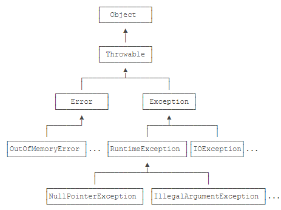

# 异常处理


## Java的异常

* Java使用异常来表示错误，并通过`try ... catch`捕获异常；

  * 把可能发生异常的代码放到`try {...}`中，然后使用`catch`捕获对应的`Exception`及其子类

* Java的异常是`class`，并且从`Throwable`继承；

  

  

  

* `Error`是无需捕获的严重错误，`Exception`是应该捕获的可处理的错误；

* `RuntimeException`无需强制捕获，非`RuntimeException`（Checked Exception）需强制捕获，或者用`throws`声明；

* 不推荐捕获了异常但不进行任何处理。


## 捕获异常

使用`try ... catch ... finally`时：

- 多个`catch`语句的匹配顺序非常重要，子类必须放在前面；
- `finally`语句保证了有无异常都会执行，它是可选的；
- 一个`catch`语句也可以匹配多个非继承关系的异常。


## 抛出异常

* 如何抛出异常

  1. 创建某个`Exception`的实例；

  2. 用`throw`语句抛出。

     ```java
     // 抛出异常
     void process2(String s) {
         if (s == null) {
             // 抛出异常
             NullPointerException e = new NullPointerException();
             throw e;
             // 抛出异常的代码一般都合写成一行，如下
             throw new NullPointerException();
         }
     }
     ```

     

* 调用`printStackTrace()`可以打印异常的传播栈，对于调试非常有用；

  * 有了完整的异常栈的信息，我们才能快速定位并修复代码的问题。

* 捕获异常并再次抛出新的异常时，应该持有原始异常信息；

* 通常不要在`finally`中抛出异常。

  * 此情况中，`finally`抛出异常后，原来在`catch`中准备抛出的异常就“消失”了，因为只能抛出一个异常。没有被抛出的异常称为“被屏蔽”的异常（Suppressed Exception）。
  * 如果在`finally`中抛出异常，应该将原始异常加入到原有异常中。调用方可通过`Throwable.getSuppressed()`获取所有添加的`Suppressed Exception`。


## 自定义异常

* 抛出异常时，尽量复用JDK已定义的异常类型；
* 自定义异常体系时，推荐从`RuntimeException`派生“根异常”，再派生出业务异常；
* 自定义异常时，应该提供多种构造方法。


## NullPointerException

* `NullPointerException`是Java代码常见的逻辑错误，应当早暴露，早修复；
* 可以启用Java 14的增强异常信息来查看`NullPointerException`的详细错误信息。


## 断言

断言（Assertion）是一种调试程序的方式。在Java中，使用`assert`关键字来实现断言。

* 断言是一种调试方式，断言失败会抛出`AssertionError`，只能在开发和测试阶段启用断言；
* 对可恢复的错误不能使用断言，而应该抛出异常；
* 断言很少被使用，更好的方法是编写单元测试。


## JDK Logging

* 日志是为了替代`System.out.println()`，可以定义格式，重定向到文件等；
* 日志可以存档，便于追踪问题；
* 日志记录可以按级别分类，便于打开或关闭某些级别；
* 可以根据配置文件调整日志，无需修改代码；
* Java标准库提供了`java.util.logging`来实现日志功能。
* Java标准库内置的Logging有很多局限，使用并不是非常广泛。


## Commons Logging

和Java标准库提供的日志不同，Commons Logging是一个第三方日志库，它是由Apache创建的日志模块。

日志API

* Commons Logging是使用最广泛的日志模块；
* Commons Logging的API非常简单；
* Commons Logging可以自动检测并使用其他日志模块。


## Log4j

日志底层

* 通过Commons Logging实现日志，不需要修改代码即可使用Log4j；
* 使用Log4j只需要把log4j2.xml和相关jar放入classpath；
* 如果要更换Log4j，只需要移除log4j2.xml和相关jar；
* 只有扩展Log4j时，才需要引用Log4j的接口（例如，将日志加密写入数据库的功能，需要自己开发）。


## SLF4J、Logback

* SLF4J和Logback可以取代Commons Logging和Log4j；
* 始终使用SLF4J的接口写入日志，使用Logback只需要配置，不需要修改代码。

