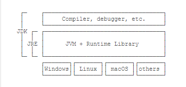

Java基础知识

* 了解并使用各种变量、数据类型
* 了解基本的程序流程控制语句
* 编写基本的Java程序


目录

* [布尔运算](#布尔运算)


---


# Java特性

## 一次编写，到处运行

* Java介于编译型语言（C）和解释型语言（python）之间，Java将代码编译成一种“字节码”，不同平台的虚拟机负责加载字节码并执行。


## JDK/ JRE

* JRE：Java Runtime Environment
  * Java运行环境的简称，为Java的运行提供了所需的环境。主要包括了JVM（Java Virtual Machine）的标准实现和一些Java基本类库。
* JDK：Java Development Kit
  * Java开发工具包，提供了Java的开发及运行环境。JDK是Java开发的核心，集成了JRE以及一些其他的工具，比如编译 Java 源码的编译器 Javac等。

简单地说，JRE就是运行Java字节码的虚拟机。但是，如果只有Java源码，要编译成Java字节码，就需要JDK，因为JDK除了包含JRE，还提供了编译器、调试器等开发工具。



* 因此可以这样认为：JDK>JRE>JVM，JRE支持了java程序的运行，而JDK则同时支持了java程序的开发。


## Java中的内存划分

Java中的内存划分为5个部分：

1. 栈（Stack）：存放的都是方法中的局部变量。方法的运行一定要在栈当中进行。

   * 局部变量：方法的参数，或者是方法内部的变量。一旦超出作用域，立刻从栈内存中消失。

2. 堆（Heap）：凡是new出来的东西，都在堆当中。

   * 堆内存里面的东西都有一个地址值：16进制

   * 堆内存里面的数据，都有默认值，规则：

     | 数据类型 | 默认值 |
     | :------- | ------ |
     | 整型     | 0      |
     | 浮点型   | 0.0    |
     | 字符型   | \u0000 |
     | 布尔型   | false  |
     | 引用类型 | null   |

3. 方法区（Method Area）：储存`.class`相关信息，包含方法的信息。

4. 本地方法栈（Native Method Stack）：与操作系统相关

5. 寄存器（pc Register）：与CPU相关


# 命名习惯

## 标识符

* 标识符是我们在程序中自己定义的内容，比如类的名字、方法的名字、变量的名字等等。

## 命名规则

* 标识符可以包含：英文字母26个（区分大小写）、数字0-9、$美元符号、_下划线。
* 标识符不能以数字开头。
* 标识符不能是关键字。

## 规范

* 类名：首字母大写，后面每个单词的首字母大写（大驼峰式）。
* 方法名：首字母小写，后面每个单词的首字母大写（小驼峰式）
* 变量名：同方法名。


# 数据类型

## 变量

* 在Java中，变量分为两种：基本类型的变量和引用类型的变量。
* 不写初始值，就相当于给它指定了默认值。默认值总是`0`。


## 常量

* 定义变量的时候，如果加上`final`修饰符，这个变量就变成了常量：

  ```java
  final double PI = 3.14; // PI是一个常量
  double r = 5.0;
  double area = PI * r * r;
  PI = 300; // compile error!
  ```

* 常量在定义时进行**初始化后就不可再次赋值**，再次赋值会导致编译错误。
* 常量的作用是用有意义的变量名来避免魔术数字（Magic number），例如，不要在代码中到处写`3.14`，而是定义一个常量。如果将来需要提高计算精度，我们只需要在常量的定义处修改，例如，改成`3.1416`，而不必在所有地方替换`3.14`。
* 根据习惯，常量名通常全部大写。


## 基本数据类型

* 基本数据类型是CPU可以直接进行运算的类型。Java定义了以下几种基本数据类型：
  - 整数类型：byte，short，int，long
  - 浮点数类型：float，double
  - 字符类型：char
  - 布尔类型：boolean
* 不同的数据类型占用的字节数不一样。我们看一下Java基本数据类型占用的字节数：


| 基本数据类型 | 内存占用 | 取值范围                           |
| ------------ | -------- | :--------------------------------- |
| byte         | 1 byte   | -2<sup>7</sup> ~ 2<sup>7</sup>-1   |
| short        | 2 byte   | -2<sup>15</sup> ~ 2<sup>15</sup>-1 |
| int          | 4 byte   | -2<sup>31</sup> ~ 2<sup>31</sup>-1 |
| long         | 8 byte   | -2<sup>63</sup> ~ 2<sup>63</sup>-1 |
| float        | 4 byte   |                                    |
| double       | 8 byte   |                                    |
| char         | 2 byte   |                                    |
| boolean      | 1 byte   |                                    |

* 1 byte = 8 bit

* `byte`恰好就是一个字节，而`long`和`double`需要8个字节。

### 整型

* 对于整型类型，Java只定义了带符号的整型，因此，最高位的bit表示符号位（0表示正数，1表示负数）。各种整型能表示的最大范围见上表。
  - 注意：同一个数的不同进制的表示是完全相同的，例如`15`=`0xf`＝`0b1111`。

### 浮点型

* 浮点类型的数就是小数，因为小数用科学计数法表示的时候，小数点是可以“浮动”的，如1234.5可以表示成12.345x10<sup>2</sup>，也可以表示成1.2345x10<sup>3</sup>，所以称为浮点数。浮点数可表示的范围非常大。

  * 对于`float`类型，需要加上`f`后缀。

  ```java
  float f1 = 3.14f;
  ```

### 布尔类型

* 布尔类型`boolean`只有`true`和`false`两个值，布尔类型总是关系运算的计算结果：

  ```java
  int age = 12;
  boolean isAdult = age >= 18; // 计算结果为false
  ```

* Java语言对布尔类型的存储并没有做规定，因为理论上存储布尔类型只需要1 byte，但是通常JVM内部会把`boolean`表示为4字节整数。

### 字符类型

* 字符类型`char`表示一个字符。Java的`char`类型除了可表示标准的ASCII外，还可以表示一个Unicode字符：

* 注意`char`类型使用单引号`'`，且仅有一个字符，要和双引号`"`的**字符串**类型区分开。


## 引用类型

* 除了上述基本类型的变量，剩下的都是引用类型。例如，引用类型最常用的就是`String`字符串：

  ```java
  String s = "hello";
  ```

  引用类型的变量类似于C语言的指针，它内部存储一个“地址”，指向某个对象在内存的位置。


# 整数运算

* 整数运算的结果永远是精确的；
* 运算结果会自动提升；
* 可以强制转型，但超出范围的强制转型会得到错误的结果；
* 应该选择合适范围的整型（`int`或`long`），没有必要为了节省内存而使用`byte`和`short`进行整数运算。


## 移位运算

* 在计算机中，整数总是以二进制的形式表示。可以对整数进行移位运算`<<`、`>>`、`>>>`。
  * 对`byte`和`short`类型进行位移时，会首先转换成`int`再进行位移。
    * 这个转换是**自动类型转换**，特点是代码不需要进行特殊处理，自动完成。规则是数据范围从小到大。

## 位运算

* 位运算是按**位**进行与、或、非和异或的运算。

  * 对两个整数进行位数运算，实际上就是按位对齐，然后依次对每一位进行运算。

    ```java
    int i = 167776589; // 00001010 00000000 00010001 01001101
    int n = 167776512; // 00001010 00000000 00010001 00000000
    System.out.println(i & n); // 167776512
    ```

  * 上述按位与运算实际上可以看作两个整数表示的IP地址`10.0.17.77`和`10.0.17.0`，通过与运算，可以快速判断一个IP是否在给定的网段内。

## 运算优先级

* 在Java的计算表达式中，运算优先级从高到低依次是：
  * `()`
  * `!` `~` `++` `--`
  * `*` `/` `%`
  * `+` `-`
  * `<<` `>>` `>>>`
  * `&`
  * `|`
  * `+=` `-=` `*=` `/=`

* 记不住可以通过加括号来保证优先级正确。


# 浮点数运算

* 浮点数常常无法精确表示，并且浮点数的运算结果可能有误差；
  * 浮点数运算和整数运算相比，只能进行加减乘除这些数值计算，不能做移位运算和位运算。
* 比较两个浮点数通常比较它们的绝对值之差是否小于一个特定值；
* 整型和浮点型运算时，整型会自动提升为浮点型；
* 可以将浮点型强制转为整型，但超出范围后将始终返回整型的最大值。


# 布尔运算

* 与运算和或运算是短路运算；

* 三元运算`b ? x : y`后面的类型必须相同，三元运算也是“短路运算”，只计算`x`或`y`。

  ```java
  int n = -100;
  int x = n >= 0 ? n : -n;
  System.out.println(x); // 100
  ```

  

* 关系运算符的优先级从高到低依次是

  * `!`
  * `>` , `>=` , `<` , `<=` 
  * `==` , `!=`
  * `&&`
  * `||`


# 字符和字符串

* Java的字符类型`char`是基本类型，字符串类型`String`是引用类型；
* 基本类型的变量是“持有”某个数值，引用类型的变量是“指向”某个对象；
* 引用类型的变量可以是空值`null`；
  * 它表示不存在，即该变量不指向任何对象。
* 要区分空值`null`和空字符串`""`。
  * 空字符串是一个有效的字符串对象，它不等于`null`。


## 转义字符

* 常见的转义字符包括：

  * `\"` 表示字符`"`

  * `\'` 表示字符`'`

  * `\\` 表示字符`\`

  * `\n` 表示换行符

  * `\r` 表示回车符

  * `\t` 表示Tab

  * `\u####` 表示一个Unicode编码的字符

    ```java
    char c3 = `\u0041`; // `A`,因为十六进制数0041 = 十进制 65
    String s = "ABC\n\u4e2d\u6587"; // 包含6个字符：A, B, C, 换行符, 中, 文
    ```

    * // \u#### 注意是十六进制

## 空值null

```java
String s1 = null; // s1是null
String s2; // 没有赋初始值，s2也是null
String s3 = s1; // s3也是null
String s4 = ""; // s4指向空字符串，不是null
```


# 数组类型

* 数组是同一数据类型的集合，数组一旦创建后，大小（长度）就不可变；
* 可以通过索引访问数组元素，但索引超出范围将报错；
* 数组元素可以是值类型（如int）或引用类型（如String），但数组本身是引用类型；
* 可以用`数组名称.length`获取数组长度。


## 数组的初始化

* 两种常见的初始化方式：

  * 动态初始化（指定长度）

  * 静态初始化（指定内容）

    ```java
    // 动态初始化数组的格式
    数据类型[] 数组名称 = new 数据类型 [数组长度]
    // PS:
    * 解析含义：
    * 左侧数据类型，也就是数组中保存的数据，全都是统一的什么类型
    * 左侧中括号，代表我是一个数组
    * 左侧组名称：给数组取一个名字
    * 右侧new：代表创建数组的动作
    * 右侧数据类型：必须和左边的数据类型保持一致
    * 右侧括号的长度，也就是数组当中，到底可以保存多少个数据，是一个int数字
    ```

    ```java
    // 静态初始化
    // 标准格式
    数据类型[] 数组名称 = new 数据类型 []{元素1,元素2,...};
    // 省略格式
    数据类型[] 数组名称 = {元素1,元素2,...};
    ```


# 流程控制

## 输入与输出

* Java提供的输出包括：`System.out.println()` / `print()` / `printf()`，其中`printf()`可以格式化输出；
  * 占位符 `%?`，可以把各种数据类型“格式化”成指定的字符串
* Java提供Scanner对象来方便输入，读取对应的类型可以使用：`scanner.nextLine()` / `nextInt()` / `nextDouble()` / ...


## if判断

在Java程序中，如果要根据条件来决定是否执行某一段代码，就需要`if`语句。

* `if ... else`可以做条件判断，`else`是可选的；

  * `if`语句的基本语法是：

    ```java
    if (条件) {
        // 条件满足时执行
    }
    ```

  * `if`语句还可以编写一个`else { ... }`，当条件判断为`false`时，将执行`else`的语句块

* 不推荐省略花括号`{}`；

* 多个`if ... else`串联要特别注意判断顺序；

* 要注意`if`的边界条件；

* 要注意浮点数判断相等不能直接用`==`运算符；

* 引用类型判断内容相等要使用`equals()`，注意避免`NullPointerException`。

  * 执行语句`s1.equals(s2)`时，如果变量`s1`为`null`，会报`NullPointerException`


## switch多重选择

* `switch`语句可以做多重选择，然后执行匹配的`case`语句后续代码；
* `switch`的计算结果必须是整型、字符串或枚举类型；
* 注意千万不要漏写`break`，建议打开`fall-through`警告；
* 总是写上`default`，建议打开`missing default`警告；
* 从Java 14开始，`switch`语句正式升级为表达式，不再需要`break`，并且允许使用`yield`返回值。


## while循环

* `while`循环先判断循环条件是否满足，再执行循环语句；
* `while`循环可能一次都不执行；
* 编写循环时要注意循环条件，并避免死循环。


## do while循环

* `do while`循环先执行循环，再判断条件；
* `do while`循环会至少执行一次。


## for循环

* `for`循环通过计数器可以实现复杂循环；
* `for each`循环可以直接遍历数组的每个元素；
* 最佳实践：计数器变量定义在`for`循环内部，循环体内部不修改计数器；


## break和continue

* `break`语句可以跳出当前循环；
* `break`语句通常配合`if`，在满足条件时提前结束整个循环；
* `break`语句总是跳出最近的一层循环；
* `continue`语句可以提前结束本次循环；
* `continue`语句通常配合`if`，在满足条件时提前结束本次循环。


# 数组控制

## 遍历数组

* 遍历数组可以使用`for`循环，`for`循环可以访问数组索引，`for each`循环直接迭代每个数组元素，但无法获取索引；

* 使用`Arrays.toString()`可以快速获取数组内容。

  ```java
  import java.util.Arrays;
  
  public class Main {
      public static void main(String[] args) {
          int[] ns = { 1, 1, 2, 3, 5, 8 };
          System.out.println(Arrays.toString(ns));
      }
  }
  ```

  

## 数组排序

* 常用的排序算法有冒泡排序、插入排序和快速排序等；

* 冒泡排序使用两层`for`循环实现排序；

  * 冒泡排序的特点是，每一轮循环后，最大的一个数被交换到末尾，因此，下一轮循环就可以“刨除”最后的数，每一轮循环都比上一轮循环的结束位置靠前一位。

* 交换两个变量的值需要借助一个临时变量。

  * 错误示范

    ```java
    int x = 1;
    int y = 2;
    
    x = y; // x现在是2
    y = x; // y现在还是2
    ```

  * 正确写法

    ```java
    int x = 1;
    int y = 2;
    
    int t = x; // 把x的值保存在临时变量t中, t现在是1
    x = y; // x现在是2
    y = t; // y现在是t的值1
    ```

  

* 可以直接使用Java标准库提供的`Arrays.sort()`进行排序；

* 对数组排序会直接修改数组本身。


## 多维数组

* 二维数组就是数组的数组，三维数组就是二维数组的数组；
* 多维数组的每个数组元素长度都不要求相同；
* 打印多维数组可以使用`Arrays.deepToString()`；
* 最常见的多维数组是二维数组，访问二维数组的一个元素使用`array[row][col]`。


## 命令行参数

* 命令行参数类型是`String[]`数组；
* 命令行参数由JVM接收用户输入并传给`main`方法；
* 如何解析命令行参数需要由程序自己实现。
