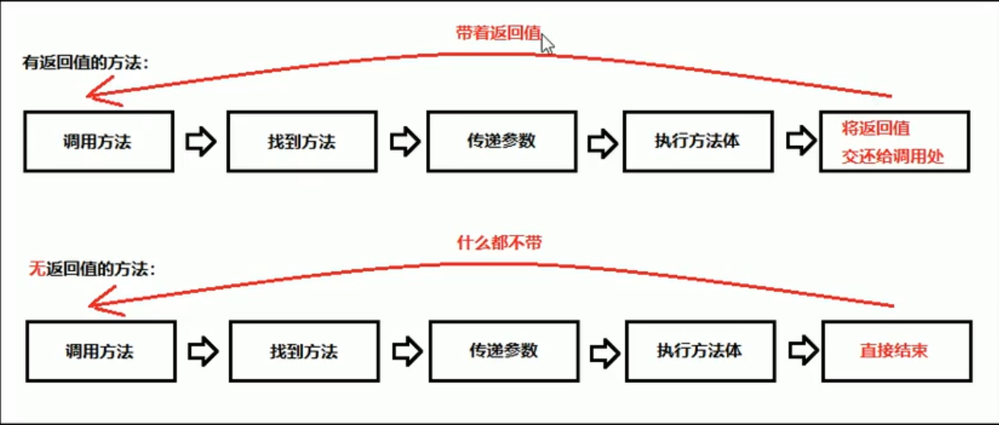

# 面向对象基础

Object-Oriented Programming，区别于面向过程，强调的是通过调用对象的行为来实现功能，而不是自己一步一步去操作实现。


## 特点

* 将复杂的事情简单化，将我们从操作者变成了指挥者。面向对象对象的语言中，包含了三大基本特征：封装、继承、多态。


## 类和对象的关系

* 在OOP中，`class`和`instance`是“模版”和“实例”的关系；
  
  * `class`是蓝图，`instance`是产品。
  
  即 **类** 可以看作一类对象的 **模板** ， **对象** 可以看成该类的一个具体 **实例** 。
* 定义`class`就是定义了一种数据类型，对应的`instance`是这种数据类型的实例；
* `class`（类）定义的`field`（字段），在每个`instance`都会拥有各自的`field`，且互不干扰；
* 通过`new`操作符**创建**新的`instance`（实例），然后用变量指向它，即可通过变量来引用这个`instance`；
* 访问实例字段的方法是`变量名.字段名`；
* 指向`instance`的变量都是引用变量。


### 例题：城市

* 请定义一个City类，该class具有如下字段:

  - name: 名称，String类型
  - latitude: 纬度，double类型
  - longitude: 经度，double类型

  实例化几个City并赋值，然后打印。

* 图解


```java
/*1.定义模板
*2.创建实例（使用new操作符）并定义一个引用类型的变量来指向这个实例。 
   格式：类名称 对象名 = new 类名称（）
*3.有了指向这个实例的变量，我们就可以通过这个变量来操作实例。  
   访问实例变量格式： 变量.字段*/

// 创建实例并打印输出
public class Demo01City {
    public static void main(String[] args) {

        City bj = new City();
        /* 创建实例，上侧代码创建了一个City类型的实例，并通过变量bj指向它。
         *  注意区分City bj是定义City类型的变量bj，
         *  而new City()是创建City实例。*/

        bj.name = "beijing"; // 对字段name赋值
        bj.latitude = 39.903; // 对字段latitude赋值
        bj.longitude = 116.401; // 对字段longtude赋值

        System.out.println(bj.name); // 打印输出 Beijing
        System.out.println("location: " + bj.latitude + ", " + bj.longitude); // 打印输出 location: 39.903, 116.401
    }
}

// 定义class
class City {
    public String name;
    public double latitude;
    public double longitude;
}

/*
1.city类（class）可以包含多个字段(field)，字段用来描述一个类的特征。
上面的City类，我们定义了三个字段，一个是String类型的字段，命名为 name，两个double类型的字段，分别命名为 latitude，longitude。
因此，通过class，把一组数据汇集到一个对象上，实现了数据封装。
2.public是用来修饰字段的，它表示这个字段可以被外部访问。
3.定义了class，只是定义了对象模版，而要根据对象模版创建出真正的对象实例，必须用new操作符。
  */
```


## 方法

* 方法是若干语句的功能集合。

  * 方法好比是一个工厂
    * 参数（原料）：就是进入方法的数据
    * 返回值（产出物）：就是从方法中出来的数据

  ```java
  // 定义方法的完整格式
  修饰符 返回值类型 方法名称（参数类型 参数名称，...）{
      方法体
          return 返回值；
  }
  // PS： 
  1.返回值类型;也就是方法最终产生的数据结果是什么类型
  2.参数类型：进入方法的数据是什么类型
  3.参数名称：进入方法的数据对应的变量名称
  4.参数如果有多个，使用逗号进行分隔
  5.return两个作用：第一停止当前方法，第二将后面的返回值还给调用处。
      一个方法中可以有多个return语句，但是必须保证只有一个会被执行。
  6.返回值：也就是方法执行后最终产生的数据结果
  7.return后面的返回值，必须和方法名称前面的“返回值类型”，保持对应。
  ```

  * 方法的三种调用格式

  ```java
  // 三种调用格式：
  1.单独调用：方法名称（参数）
  2.打印调用：System.out.println(方法名称（参数）);
  3.赋值调用：数据类型 变量名称 = 方法名称（参数）；
  // PS:
  1.不返回任何值（void）的方法，只能被单独调用。
  ```

  * 对比方法的有参数和无参数

  ```java
  // 对比方法的有参数和无参数
  1.有参数：小括号中有内容，当一个方法需要一些数据条件，才能完成任务的时候，就是有参数。
      比如两个数字相加，必须知道两个数字各自是多少，才能相加。
  2.无参数：小括号中留空，一个方法不需要任何数据条件，自己就能独立完成任务，就是无参数。
  ```

  * 对比方法的有返回值和无返回值

  

  

* 方法可以让外部代码安全地访问实例字段；

* 方法是一组执行语句，并且可以执行任意逻辑；

* 方法内部遇到return时返回，void表示不返回任何值（注意和返回null不同）；

* 外部代码通过public方法操作实例，内部代码可以调用private方法；

* 理解方法的参数绑定。


## 构造方法

* 实例在创建时通过`new`操作符会调用其对应的构造方法，构造方法用于初始化实例；
* 没有定义构造方法时，编译器会自动创建一个默认的无参数构造方法；
* 可以定义多个构造方法，编译器根据参数自动判断；
* 可以在一个构造方法内部调用另一个构造方法，便于代码复用。


## 方法重载

* 方法重载(Overload)是指多个方法的方法名相同，但各自的参数不同；
  * 只需要记一个方法名，就可以实现类似的多个功能，调用更简单。
* 重载方法应该完成类似的功能，参考`String`的`indexOf()`；
* 重载方法返回值类型应该相同。


## 继承

* 继承是面向对象编程的一种强大的代码复用方式；
* Java只允许单继承，所有类最终的根类是`Object`；
* `protected`允许子类访问父类的字段和方法；
* 子类的构造方法可以通过`super()`调用父类的构造方法；
* 可以安全地向上转型为更抽象的类型；
  * 把一个子类类型安全地变为父类类型的赋值，被称为向上转型（upcasting）。
* 可以强制向下转型，最好借助`instanceof`判断；
* 子类和父类的关系是is，has关系不能用继承。


## 多态

* 子类可以覆写父类的方法（Override），覆写在子类中改变了父类方法的行为；
  * 在继承关系中，子类如果定义了一个与父类方法签名完全相同的方法，被称为覆写。
* Java的方法调用总是作用于运行期对象的实际类型，这种行为称为多态；
  * 多态具有一个非常强大的功能，就是允许添加更多类型的子类实现功能扩展，却不需要修改基于父类的代码。
* `final`修饰符有多种作用：
  - `final`修饰的方法可以阻止被覆写；
  - `final`修饰的class可以阻止被继承；
  - `final`修饰的field必须在创建对象时初始化，随后不可修改。


## 抽象类

* 通过`abstract`定义的方法是抽象方法，它只有定义，没有实现。抽象方法定义了子类必须实现的接口规范；
* 定义了抽象方法的class必须被定义为抽象类，从抽象类继承的子类必须实现抽象方法；
* 如果不实现抽象方法，则该子类仍是一个抽象类；
* 面向抽象编程使得调用者只关心抽象方法的定义，不关心子类的具体实现